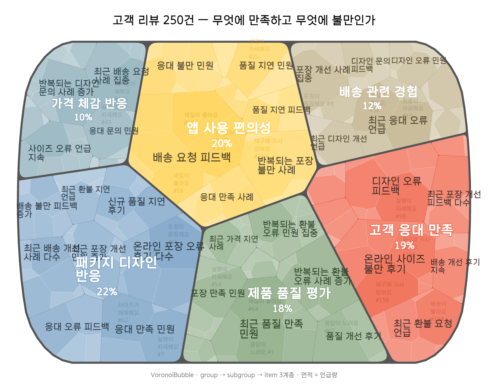

# VoronoiBubble

[한국어 문서](README.ko.md)

VoronoiBubble is a prebuilt renderer for drawing Voronoi treemaps easily, with optional semantic position hints. Pass tidy-style flat rows with `group -> subgroup -> item -> size` columns and it renders a three-level responsive SVG directly. You do not need to build `d3.hierarchy()` data, wire resize code, or hand-tune a raw geometric layout.

Traditional Voronoi treemaps are good at showing hierarchy and area, but the cell positions usually carry little meaning. VoronoiBubble keeps the hierarchy and size encoding, while `positions` lets you guide groups or subgroups with UMAP-like coordinates so similar concepts can appear near each other.

This makes it especially useful for qualitative data maps from reviews, surveys, and interviews. It also fits prepared hierarchies such as government budgets, book maps, document taxonomies, organization sizes, and project portfolios. VoronoiBubble is the rendering engine used by AffinityBubble.



## Features

- **Three-level Voronoi treemap**: `group` (depth 1) -> `subgroup` (depth 2) -> `item` (depth 3), with separate labels and pebble-style outlines for upper levels.
- **Tidy-style flat rows**: render `{ group, subgroup, item, size }[]` directly. Use `levels` and `value` when your column names differ.
- **Easy colors and sentiment colormaps**: use `colors: "waterLilies"` for built-in palette presets, set `groupColors` for direct group colors, or use `sentiment: "score"` to map numeric ratings to a red-yellow-green diverging palette.
- **Positioning hints and readable labels**: use `positions` for depth-aware relative placement, or `VoronoiBubbleHelpers.createGridPositions()` for a stable grid order. Default label adjustment reduces overlap inside cell boundaries.
- **Popups and hover callbacks**: `onClick` with `showVoronoiPopup` works without extra CSS; `onHover` and `onSubgroupLabelHover` let you attach custom tooltips.
- **Responsive SVG**: generated charts use `viewBox`, `width: 100%`, and `height: auto`.
- **Reproducible layouts**: the same `seedRandom` gives the same layout.
- **Custom HTML labels**: `renderGroupLabel` and `renderSubgroupLabel` can return HTML rendered through `foreignObject`.

## Quick Start

```html
<div id="chart"></div>

<script type="module">
  import { VoronoiBubble, VoronoiBubbleHelpers } from 'https://cdn.jsdelivr.net/gh/pxd-uxtech/voronoi-bubble-dist@v2.0.1/dist/voronoi-bubble.standalone.js';

  const data = [
    { group: 'Positive', subgroup: 'Delivery', item: 'Fast delivery', size: 30, score: 5 },
    { group: 'Positive', subgroup: 'Quality', item: 'Good material', size: 25, score: 5 },
    { group: 'Neutral', subgroup: 'Packaging', item: 'Acceptable packaging', size: 12, score: 3 },
    { group: 'Negative', subgroup: 'Price', item: 'Too expensive', size: 15, score: 2 },
    { group: 'Negative', subgroup: 'Support', item: 'Slow response', size: 8, score: 1 },
  ];

  const svg = new VoronoiBubble().render(data, {
    width: 1200,
    height: 900,
    title: 'Customer Feedback',
    caption: 'Review topic map',
    showGroupLabel: true,
    showPercent: true,
    colors: 'waterLilies',
    // Use groupColors when you want exact group colors:
    // groupColors: { Positive: '#4CAF50', Neutral: '#FFC107', Negative: '#F44336' },
    sentiment: 'score',
    positions: VoronoiBubbleHelpers.createGridPositions(
      ['Positive', 'Neutral', 'Negative'],
      { depth: 1 }
    ),
  });

  document.getElementById('chart').appendChild(svg);
</script>
```

See [`examples/`](examples/) for runnable examples. `examples/index.html` is the gallery.

## Use Cases

- Qualitative maps from customer reviews, survey open responses, interviews, and coded text.
- Government budgets, organization costs, team sizes, and portfolio maps.
- Book maps, literature reviews, document classifications, and knowledge taxonomies.
- Semantic maps where embedding or UMAP coordinates are passed through `positions`.

## CDN

```text
https://cdn.jsdelivr.net/gh/pxd-uxtech/voronoi-bubble-dist@v2.0.1/dist/voronoi-bubble.standalone.js
```

| Situation | File | Loading style |
|---|---|---|
| `import` / `import()` (recommended) | `voronoi-bubble.standalone.js` | ESM, all dependencies bundled |
| `<script>` tag or local `file://` | `voronoi-bubble.standalone.umd.js` | global `VoronoiBubbleModule` |
| Bundlers such as Vite/Webpack | `voronoi-bubble.esm.js` | peer dependencies required |
| Peer dependencies loaded separately | `voronoi-bubble.umd.js` / `voronoi-bubble.min.js` | global `VoronoiBubble` |

Do not load `.umd.js` with `import()`. UMD exposes globals; it does not provide ESM named exports.

## Positioning

`positions` are scale-free, depth-aware relative placement hints:

```js
new VoronoiBubble().render(data, {
  positions: [
    { key: 'Positive', depth: 1, x: 1, y: 0 },
    { key: 'Neutral', depth: 1, x: 0.5, y: 0.5 },
    { key: 'Negative', depth: 1, x: 0, y: 1 },
  ],
});
```

If you have UMAP coordinates for all depth-2 subgroups, pass them as-is. VoronoiBubble normalizes coordinates by depth. If you only need a stable reading order, use the grid helper:

```js
const groups = ['Positive', 'Neutral', 'Negative', 'Other'];

new VoronoiBubble().render(data, {
  positions: VoronoiBubbleHelpers.createGridPositions(groups, { depth: 1 }),
});
```

## Documentation

- [docs/API.md](docs/API.md): data format, options, callbacks, Public CSS API, popups, sentiment colormaps, positions, and label options.
- [docs/MIGRATION.md](docs/MIGRATION.md): v1 -> v2 rename guide.
- [docs/OPEN_CORE_STRATEGY.md](docs/OPEN_CORE_STRATEGY.md): open renderer, AffinityBubble API boundary, agent strategy, and positions policy.
- [CHANGELOG.md](CHANGELOG.md): release history.
- [CONTRIBUTING.md](CONTRIBUTING.md): distribution repository notes.
- [examples/](examples/): runnable examples.

## Agent Instructions

This repository includes agent instructions in `skills/voronoi-bubble/`. ChatGPT, Codex, Claude, and other coding agents can use the skill to map user data to `group -> subgroup -> item -> size` rows and generate browser-openable Voronoi treemap HTML with popups.

- Default output: single HTML file using the CDN UMD bundle (`skills/voronoi-bubble/assets/cdn-popup-template.html`).
- Offline output: HTML using local `./dist/voronoi-bubble.standalone.umd.js` (`skills/voronoi-bubble/assets/local-popup-template.html`).
- Plugin packaging: `.codex-plugin/plugin.json` packages the skill as a skills-only plugin.

Ask an agent for something like: “Create a popup-enabled Voronoi treemap HTML chart from this data.” Add an MCP server or ChatGPT UI later if you need automatic analysis, hosted rendering, or live external data.

## Distribution Package

This repository contains prebuilt distribution files. Use the CDN URL above or download files from `dist/`.

| Path | Description |
|---|---|
| `dist/` | Prebuilt ESM, UMD, and standalone bundles |
| `examples/` | Runnable examples and gallery |
| `docs/` | API, migration, and strategy documents |
| `skills/` | Agent instructions and HTML templates for ChatGPT, Codex, Claude, and coding agents |
| `.codex-plugin/` | Skills-only plugin metadata |

## Source Development

This distribution repository is MIT-licensed. The source development repository and public contribution workflow may use a different license while they are being prepared.

The AffinityBubble API is a separate commercial service for turning raw text into embeddings, clusters, hierarchy, UMAP positions, summaries, and representative excerpts. VoronoiBubble is the open distribution renderer for prepared hierarchical data and optional position hints.

## License

The prebuilt bundles, examples, documentation, and agent instructions in this distribution repository are available under the [MIT License](LICENSE).

See [LICENSE](LICENSE) for the full terms.
